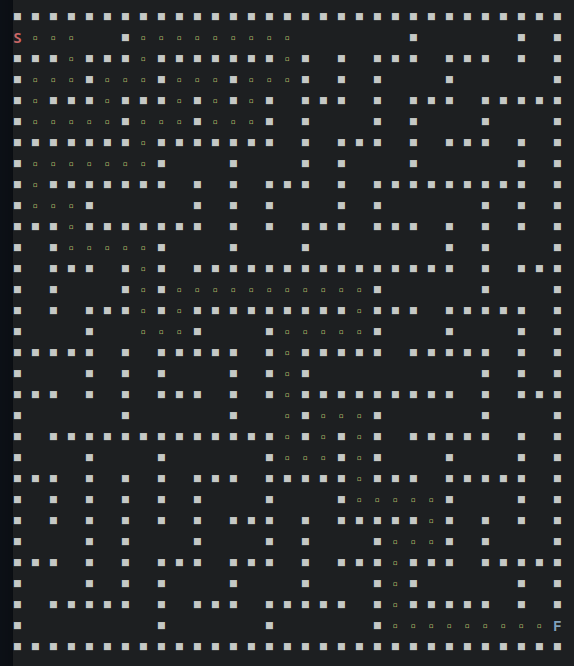
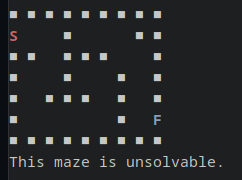
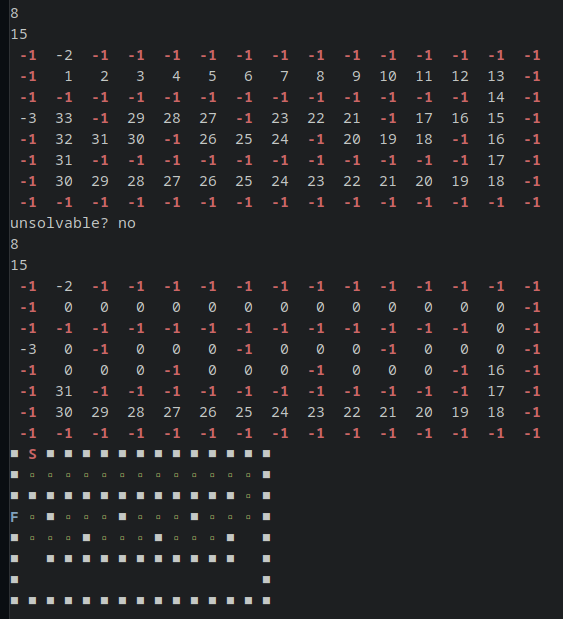

# Maze Breaker

Project for my ALG1 course

## Description

This is a simple console application for solving mazes written in C++. The path is found using breadth first traversal, where each tile in the maze is given a value coresponding to its distance from the start. When each tile has been evaluated, the maze is traversed recursively from the end to the start based on the tiles' distance from the start.

The program can handle unsolvable mazes or mazes with multiple or zero starting or ending tiles.

## Usage

```cpp
// create a maze
Maze maze;

// specify the maze to be solved, the output file and whether to print it into the console
maze.Solve("./Data/bludiste_0.txt", "./Data/output.txt", true);

// solve the maze with additional prints during path calculation
maze.SolveDebug("./Data/bludiste_1.txt", "./Data/output.txt");
```

### Maze format

The input and output maze are entered in a text file starting with two lines specifying the height and width of the maze. Then follows the maze itself represented by an array of numbers with the following meanings:

- 0: path
- 1: wall
- 2: start
- 3: finish
- 4: solved path (added in the output file)

## Examples

### Solved maze


### Unsolvable maze


### Solving process


> Originally made in May 2022